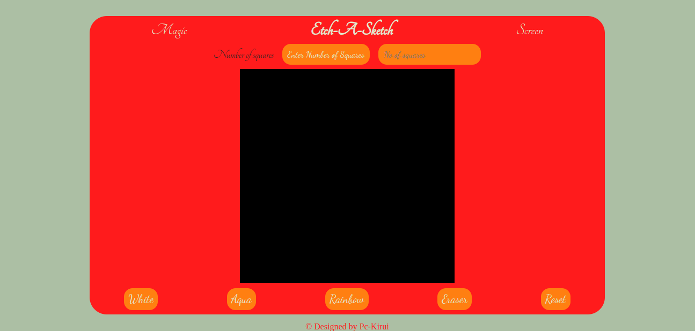

# Etch-A-Sketch

Browser version of something between a sketchpad and and Etch-A-Sketch.

# Introduction

Etch-A-Sketch is a browser-based interactive drawing pad. It serves as an exercise for practising and sharpening skills in HTML, CSS and Javascript.

## Assignment

Project instructions can be found through this [link](https://www.theodinproject.com/lessons/foundations-etch-a-sketch).

### Technologies and Tools Used

- HTML
- CSS
- Javascript
- Git and Github

### Preview

**Lessons learned**

- Creating grids/divs using javascript and flexbox
- DOM manipulation skills
- Improved my HTML and CSS skills
